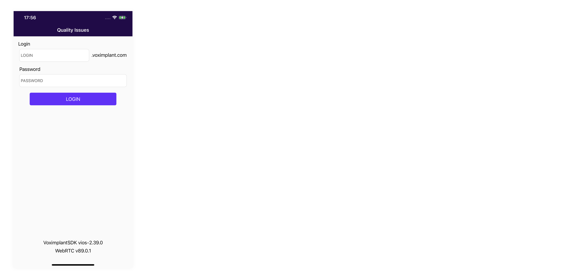
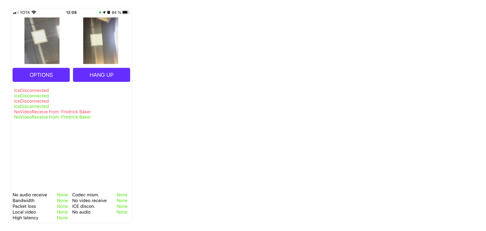
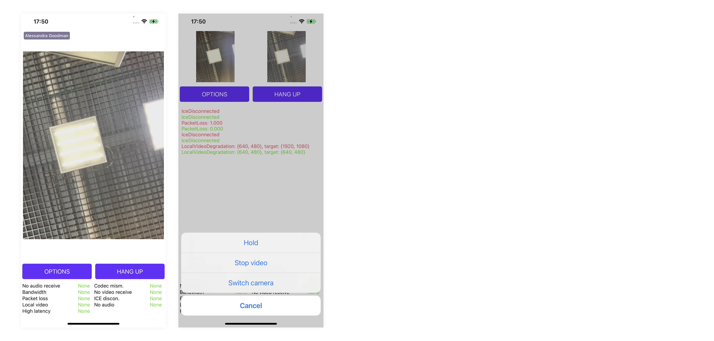

# Voximplant Quality Issues Demo (iOS)

This demo demonstrates quality issue notification functionality of the Voximplant iOS SDK. The application supports video and conference calls between this iOS app and other apps that use any Voximplant SDK.

> This demo application doesn't handle push notifications, so it doesn't receive incoming calls if the application is in the background or killed.

#### Features
The application is able to:
- log in to the Voximplant Cloud
- make a video call
- make a conference call (up to 4 video streams supported)
- receive and display quality issue notifications
- put a call on hold / take it off hold
- enable/disable sending video
- switch camera

## Getting started

To get started, you'll need to [register](https://manage.voximplant.com/auth/sign_up) a free Voximplant developer account.

You'll need the following:
- Voximplant application
- two Voximplant users
- VoxEngine scenario
- routing setup

### Automatic
We've implemented a special template to enable you to quickly use the demo – just 
install [SDK tutorial](https://manage.voximplant.com/marketplace/sdk_tutorial) from our marketplace:


### Manual

You can set up it manually using our [Gettins started](https://voximplant.com/docs/introduction) guide and tutorials

#### VoxEngine scenario example:
  ```
  VoxEngine.addEventListener(AppEvents.CallAlerting, (e) => {
  const newCall = VoxEngine.callUserDirect(
    e.call, 
    e.destination,
    e.callerid,
    e.displayName,
    null
  );
  VoxEngine.easyProcess(e.call, newCall, ()=>{}, true);
  });
  ```

## Installing

1. Clone this repo

2. Open the `ObjectiveC.xcodeproj` workspace

3. Target Quality Issues and build the project using Xcode

## Usage

### User login


Log in using:
* Voximplant user name in the format `user@app.account`
* password

See the following classes for code details:
- [QIVoxClientManager.m](Managers/QIVoxClientManager.m)
- [QILoginViewController.m](UI/QILoginViewController.m)

### Make call


Enter a Voximplant user name to the input field and press "Call" button to make a call.

See the following classes for code details:
- [QIVoxClientManager.m](Managers/QIVoxClientManager.m)
- [QIDialerViewController.m](UI/QIDialerViewController.m)

### Quality Issues

Quality Issues with current status are listed at the bottom and also logged to the text view on the middle of the screen.



See the following classes for code details:
- [QICallViewController.m](UI/QICallViewController.m)
  
### Manage call



Hold, change video sending or switch camera during a call from options menu.
Tap on a video view to enlarge or decrease it.

See the following classes for code details:
- [QICallViewController.m](UI/QICallViewController.m)

## Useful links
1. [Getting started](https://voximplant.com/docs/introduction)
2. [Voximplant iOS SDK reference](https://voximplant.com/docs/references/iossdk)
3. [Installing the Voximplant iOS SDK](https://voximplant.com/docs/introduction/integration/adding_sdks/installing/ios_sdk)
4. [HowTo's](https://voximplant.com/docs/howtos) 
